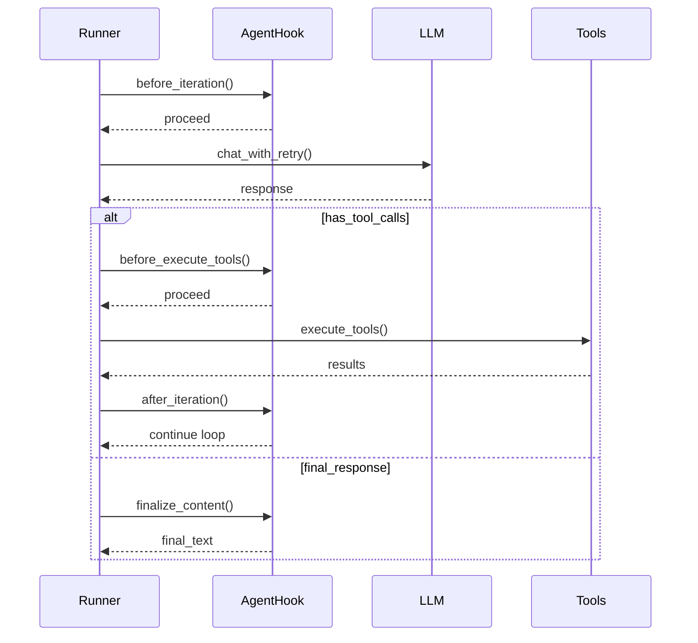

# Nanobot - Hooks & Webhooks System

## 🪝 Agent Hooks

### 🎯 Tổng quan

Hooks cho phép bạn **intercept và modify** behavior của agent loop tại các điểm quan trọng trong execution lifecycle.

### Location
`nanobot/agent/hook.py`

### Hook Architecture



### Hook Interface

```python
@dataclass
class AgentHookContext:
    """Context available to hooks."""
    iteration: int
    messages: list[dict]
    response: LLMResponse | None = None
    usage: dict | None = None
    tool_calls: list[ToolCallRequest] = field(default_factory=list)
    tool_results: list[Any] = field(default_factory=list)
    tool_events: list[dict] = field(default_factory=list)
    final_content: str | None = None
    error: str | None = None
    stop_reason: str | None = None

class AgentHook(ABC):
    """Abstract hook class."""
    
    async def before_iteration(self, ctx: AgentHookContext) -> None:
        """Called before each LLM iteration."""
        pass
    
    async def before_execute_tools(self, ctx: AgentHookContext) -> None:
        """Called before tool execution."""
        pass
    
    async def after_iteration(self, ctx: AgentHookContext) -> None:
        """Called after each iteration."""
        pass
    
    def wants_streaming(self) -> bool:
        """Return True to enable streaming callbacks."""
        return False
    
    async def on_stream(self, ctx: AgentHookContext, delta: str) -> None:
        """Called for each streaming text chunk."""
        pass
    
    async def on_stream_end(self, ctx: AgentHookContext, *, resuming: bool = False) -> None:
        """Called when streaming ends."""
        pass
    
    def finalize_content(self, ctx: AgentHookContext, content: str) -> str:
        """Modify final response content."""
        return content
```

### Hook Points

| Hook Method | Timing | Use Case |
|-------------|--------|----------|
| `before_iteration` | Trước mỗi LLM call | Logging, metrics |
| `before_execute_tools` | Trước tool execution | Tool validation |
| `after_iteration` | Sau mỗi iteration | Save state, cleanup |
| `wants_streaming` | Check streaming | Enable real-time updates |
| `on_stream` | Mỗi text chunk | Real-time display |
| `on_stream_end` | Streaming kết thúc | Finalize UI |
| `finalize_content` | Trước khi return | Content modification |

### Custom Hook Examples

#### Logging Hook
```python
class LoggingHook(AgentHook):
    async def before_iteration(self, ctx: AgentHookContext):
        logger.info(f"Starting iteration {ctx.iteration}")
    
    async def after_iteration(self, ctx: AgentHookContext):
        logger.info(f"Completed iteration {ctx.iteration}, "
                   f"tools_used={len(ctx.tool_calls)}")
```

#### Metrics Hook
```python
class MetricsHook(AgentHook):
    def __init__(self):
        self.iterations = 0
        self.tool_calls = 0
        self.total_tokens = 0
    
    async def before_iteration(self, ctx):
        self.iterations += 1
    
    async def before_execute_tools(self, ctx):
        self.tool_calls += len(ctx.tool_calls)
    
    def finalize_content(self, ctx, content: str) -> str:
        return f"{content}\n\n[Metrics: {self.iterations} iterations]"
```

#### Streaming Hook
```python
class StreamingHook(AgentHook):
    def __init__(self, channel):
        self.channel = channel
    
    def wants_streaming(self) -> bool:
        return True
    
    async def on_stream(self, ctx, delta: str):
        await self.channel.send_delta(delta)
    
    async def on_stream_end(self, ctx, *, resuming: bool = False):
        if not resuming:
            await self.channel.finalize_stream()
```

### Composite Hooks

```python
class CompositeHook(AgentHook):
    """Kết hợp nhiều hooks."""
    
    def __init__(self, hooks: list[AgentHook]):
        self.hooks = hooks
    
    async def before_iteration(self, ctx):
        for hook in self.hooks:
            await hook.before_iteration(ctx)
    
    async def after_iteration(self, ctx):
        for hook in self.hooks:
            await hook.after_iteration(ctx)
    
    def wants_streaming(self) -> bool:
        return any(h.wants_streaming() for h in self.hooks)
    
    def finalize_content(self, ctx, content: str) -> str:
        result = content
        for hook in self.hooks:
            result = hook.finalize_content(ctx, result)
        return result
```

### Registering Hooks

```python
# Trong AgentLoop initialization
loop = AgentLoop(
    hooks=[
        LoggingHook(),
        MetricsHook(),
        StreamingHook(channel),
    ]
)
```

## 🌐 Webhooks

### ⚠️ Lưu ý quan trọng

**Nanobot KHÔNG có built-in generic webhook system**. Có các cách để implement:

### 1. API Server Webhooks

```python
# nanobot/api/server.py - Extend cho webhook support
from aiohttp import web

async def webhook_handler(request):
    """Receive webhook from external service."""
    data = await request.json()
    
    # Process webhook
    agent_loop = request.app["agent_loop"]
    
    # Send to agent
    response = await agent_loop.process_direct(
        content=f"Webhook received: {data}",
        session_key=f"webhook:{data.get('event')}"
    )
    
    return web.json_response({"status": "processed"})

# Register route
app.router.add_post("/webhook", webhook_handler)
```

### 2. Channel-Specific Webhooks

| Channel | Protocol | Webhook Support |
|---------|---------|-----------------|
| **Feishu** | WebSocket | ✅ Built-in Long Connection |
| **DingTalk** | Stream Mode | ✅ Built-in |
| **Slack** | Socket Mode | ✅ Built-in |
| **Discord** | WebSocket | ✅ Built-in |
| **Telegram** | Polling | ❌ Need polling setup |

### 3. Feishu Webhook (CardKit Streaming)

```python
# Feishu sử dụng CardKit cho streaming
class FeishuChannel(BaseChannel):
    async def send(self, msg: OutboundMessage):
        if msg.metadata.get("_stream_delta"):
            await self._update_streaming_card(
                msg.chat_id,
                msg.content,
                msg.metadata.get("_stream_id")
            )
```

### 4. Outgoing Webhooks (Calling External Services)

```python
# Skills có thể gọi external webhooks
async def call_webhook(url: str, payload: dict):
    """Call external webhook endpoint."""
    async with httpx.AsyncClient() as client:
        response = await client.post(
            url,
            json=payload,
            headers={
                "Content-Type": "application/json",
                "X-Webhook-Signature": compute_signature(payload)
            }
        )
        return response.json()
```

### 5. Event-Based Webhooks

```python
# Custom webhook skill
class WebhookSkill:
    """Register webhooks for specific events."""
    
    def register(self, event: str, url: str, secret: str):
        """Register webhook endpoint for event."""
        self._webhooks[event] = {"url": url, "secret": secret}
    
    async def trigger(self, event: str, data: dict):
        """Trigger registered webhooks for event."""
        if event not in self._webhooks:
            return
        
        webhook = self._webhooks[event]
        await self._send_webhook(webhook["url"], data, webhook["secret"])
    
    async def _send_webhook(self, url: str, data: dict, secret: str):
        """Send webhook with signature."""
        payload = json.dumps(data)
        signature = hmac.new(
            secret.encode(),
            payload.encode(),
            hashlib.sha256
        ).hexdigest()
        
        await httpx.async_post(url, content=payload, headers={
            "Content-Type": "application/json",
            "X-Webhook-Signature": signature
        })
```

### Webhook Security

```python
# Verify webhook signatures
async def verify_webhook(request, secret: str) -> bool:
    """Verify webhook authenticity."""
    signature = request.headers.get("X-Webhook-Signature")
    if not signature:
        return False
    
    body = await request.read()
    expected = hmac.new(
        secret.encode(),
        body,
        hashlib.sha256
    ).hexdigest()
    
    return hmac.compare_digest(signature, expected)
```

## 📊 So sánh Extension Points

| Extension Point | Timing | Blocking | Use Case |
|----------------|--------|----------|----------|
| **Priority Commands** | Before lock | No | Emergency actions |
| **Hooks** | During loop | Yes | Lifecycle events |
| **Interceptors** | After prefix | Yes | Conditional routing |
| **Webhooks** | Async | No | External integration |

## 💡 Best Practices

### Hooks
1. **Keep hooks lightweight** - không blocking LLM loop
2. **Use composite hooks** - tách biệt concerns
3. **Check `wants_streaming()`** - chỉ enable khi cần
4. **Return context modifications** - không mutate directly

### Webhooks
1. **Use async handlers** - không block main loop
2. **Implement retries** - external services có thể fail
3. **Validate signatures** - security cho incoming
4. **Timeout handling** - prevent hanging

## ⚙️ Configuration

### Hook Configuration
```json
{
  "agents": {
    "defaults": {
      "hooks": {
        "streaming": true,
        "metrics": false,
        "logging": true
      }
    }
  }
}
```

## 📁 Related Files

- `nanobot/agent/hook.py` - Hook interface
- `nanobot/api/server.py` - API server
- `nanobot/channels/` - Channel implementations
