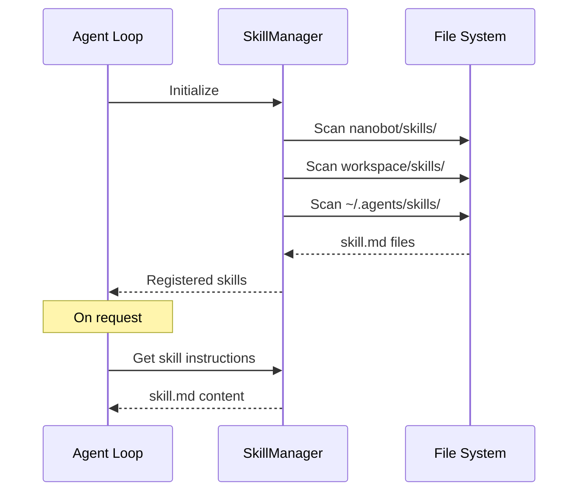

# Nanobot - Skills System

## 🎯 Tổng quan

Skills là cách để mở rộng khả năng của Nanobot agent thông qua các instructions và tooling được đóng gói. Skills cho phép agent có quyền truy cập vào các tools, knowledge, và workflows đặc biệt.

## 📁 Cấu trúc Skills

### Built-in Skills Location
```
nanobot/skills/
├── clawhub/         # ClawHub marketplace
├── cron/           # Scheduled task management
├── github/         # GitHub API operations
├── memory/         # Memory persistence
├── skill-creator/  # Create new skills
├── summarize/       # Text summarization
├── tmux/           # Terminal session management
└── weather/        # Weather information
```

### Skill Structure
```
skill_name/
├── skill.md          # Required: Skill definition
├── (optional files)  # Supporting files
└── scripts/          # Optional shell scripts
```

### Skill Definition (skill.md)
```markdown
# Skill Name

## Description
Brief description of what this skill does.

## Triggers
- When user mentions specific keywords
- When task matches certain patterns

## Instructions
Step-by-step instructions for the agent.

## Tools
Available tools for this skill:
- tool_name: Description

## Examples
Example interactions or use cases.
```

## 🔧 Built-in Skills

### 1. ClawHub Skill
```markdown
# ClawHub Skill

Integrates with ClawHub marketplace for public agent skills.
```

**Usage**:
```
Read https://clawhub.ai/skill.md
```
Agent tự động parse và cài đặt skill từ URL.

### 2. Cron Skill
```markdown
# Cron Skill

Manage scheduled reminders and recurring tasks.
```

**Available Tools**:
- `cron.create(expression, message)` - Create scheduled job
- `cron.list()` - List all jobs
- `cron.remove(job_id)` - Remove a job

**Triggers**:
- "remind me to..."
- "schedule..."
- "every Monday at 9am..."

### 3. GitHub Skill
```markdown
# GitHub Skill

GitHub repository and PR management.
```

**Available Tools**:
- `mcp_github_*` - MCP tools for GitHub operations

**Triggers**:
- "check my PRs"
- "create a repo"
- "list repositories"

### 4. Memory Skill
```markdown
# Memory Skill

Persistent knowledge storage and retrieval.
```

**Triggers**:
- "remember that..."
- "what do you know about..."
- "forget about..."

### 5. Summarize Skill
```markdown
# Summarize Skill

Text summarization capabilities.
```

**Available Tools**:
- `summarize(text)` - Generate summary

### 6. Skill Creator
```markdown
# Skill Creator

Create and manage custom skills.
```

**Usage**:
```
/skill create <name>
```

## 🔌 MCP Integration

### MCP Tools
MCP (Model Context Protocol) tools được đăng ký với prefix `mcp_`:

```python
# MCP tool naming convention
mcp_github_list_repos
mcp_github_create_issue
mcp_filesystem_read_file
```

### MCP Configuration
```json
{
  "mcp": {
    "servers": {
      "github": {
        "command": "npx",
        "args": ["-y", "@modelcontextprotocol/server-github"]
      }
    }
  }
}
```

## 📦 Tạo Custom Skill

### Step 1: Tạo Directory
```
nanobot/skills/my-skill/
├── skill.md
└── (optional files)
```

### Step 2: Viết Skill Definition
```markdown
# My Custom Skill

## Description
This skill does something useful.

## Triggers
- "do something with X"
- "use my skill for Y"

## Instructions
When this skill is triggered:

1. First, [initial step]
2. Then, [next step]
3. Finally, [final step]

Use the available tools to accomplish the task.

## Available Tools
- tool_name: What this tool does

## Examples
User: "do something with data"
Agent: [Uses skill to process the request]
```

### Step 3: Register Skill
Skills trong `nanobot/skills/` được tự động discovered.

## 🌍 Global Skills Support

### Concept
Global skills cho phép share skills across multiple projects/workspaces.

### Suggested Location
```
~/.agents/skills/
├── shared-skill-1/
│   └── skill.md
├── shared-skill-2/
│   └── skill.md
```

### Priority Order
1. **Project skills** (`./nanobot/skills/`) - Highest priority
2. **Workspace skills** (`<workspace>/skills/`)
3. **Global skills** (`~/.agents/skills/`) - Fallback

### Implementation Notes
Để implement global skills support:

```python
# Suggested addition to nanobot/agent/skills.py

import os
from pathlib import Path

GLOBAL_SKILLS_PATH = Path.home() / ".agents" / "skills"

class SkillManager:
    def __init__(self, workspace: Path):
        self.workspace = workspace
        self.global_path = GLOBAL_SKILLS_PATH
    
    def discover_skills(self) -> list[Skill]:
        skills = []
        
        # Priority 1: Project skills
        project_path = Path("nanobot/skills")
        if project_path.exists():
            skills.extend(self._load_skills_from(project_path))
        
        # Priority 2: Workspace skills
        workspace_skills = self.workspace / "skills"
        if workspace_skills.exists():
            skills.extend(self._load_skills_from(workspace_skills))
        
        # Priority 3: Global skills
        if self.global_path.exists():
            skills.extend(self._load_skills_from(self.global_path))
        
        return skills
```

## 🔄 Skill Loading Flow



## 💡 Best Practices

### 1. Skill Naming
- Use lowercase with hyphens: `my-awesome-skill`
- Include descriptive prefix: `github-*`, `cron-*`

### 2. Triggers
- Be specific to avoid false matches
- Include variations for natural language

### 3. Instructions
- Keep instructions concise
- Use numbered steps for clarity
- Include error handling guidance

### 4. Examples
- Provide 2-3 example interactions
- Show expected inputs/outputs

## ⚙️ Configuration

### Skills Config
```json
{
  "skills": {
    "enabled": true,
    "globalPath": "~/.agents/skills",
    "cacheEnabled": true
  }
}
```

### Environment Variables
```bash
NANOBOT_SKILLS_PATH=~/.nanobot/skills
NANOBOT_SKILLS_ENABLED=true
```

## 🐛 Troubleshooting

### Skill Not Found
```bash
# Check skill directory exists
ls nanobot/skills/<skill-name>/skill.md

# Verify skill.md syntax
cat nanobot/skills/<skill-name>/skill.md
```

### Skill Not Loading
```bash
# Enable debug logging
NANOBOT_LOG_LEVEL=DEBUG nanobot agent

# Check skill discovery
# Look for "Loaded skill: <name>" in logs
```

## 📚 References

- [ClawHub](https://clawhub.ai) - Public skill marketplace
- [MCP Documentation](https://modelcontextprotocol.io) - MCP protocol

## 🔮 Future Enhancements

1. **Skill versioning** - Semantic versioning cho skills
2. **Skill dependencies** - Skills that require other skills
3. **Skill marketplace** - Built-in marketplace UI
4. **Skill testing** - Unit tests cho skills
5. **Skill analytics** - Track skill usage patterns
