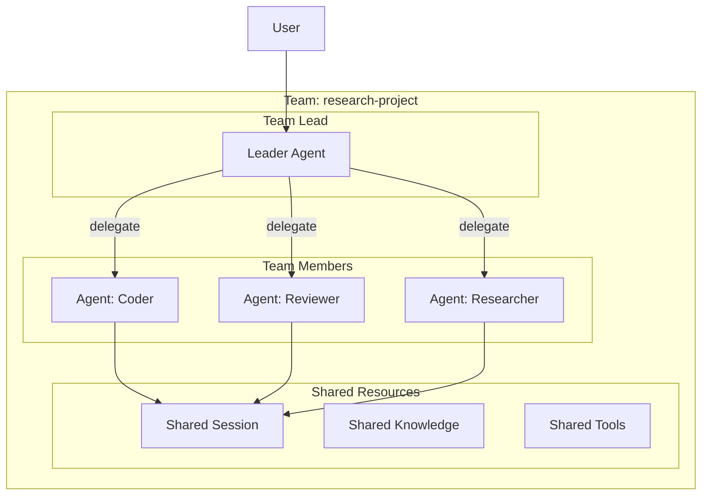
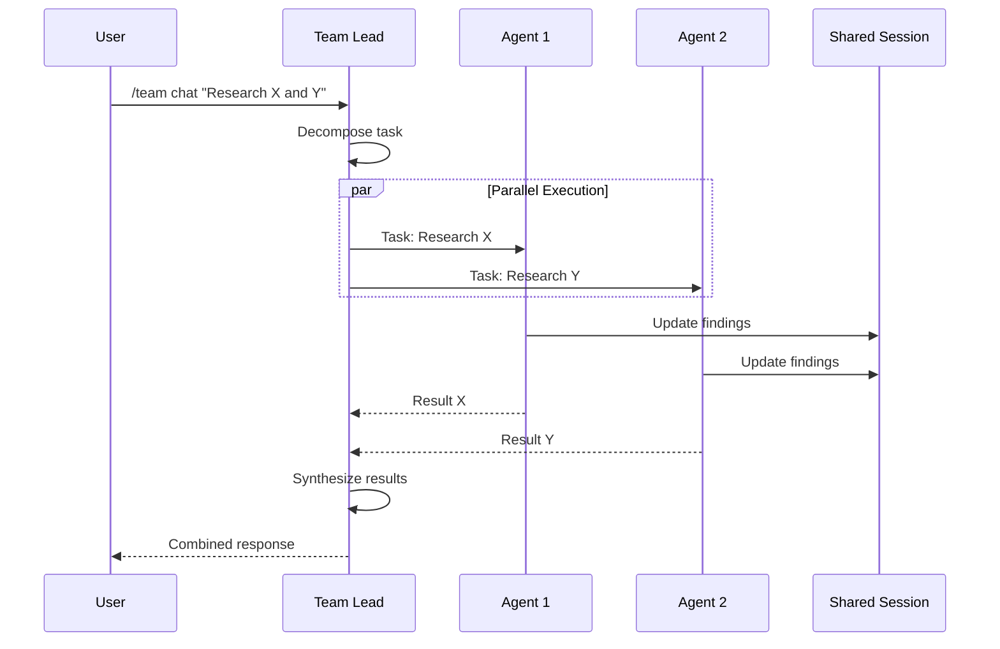

# Nanobot - Team & Subagent System

## 🎯 Tổng quan

Nanobot hỗ trợ **multi-agent collaboration** thông qua hai cơ chế:
1. **Team Mode** - Quản lý nhóm agents với shared context
2. **Subagent** - Nested agent execution cho delegated tasks

## 👥 Team System

### Khái niệm

Team là một nhóm agents cùng làm việc trên một mục tiêu chung, chia sẻ:
- **Shared session** - Lịch sử hội thoại chung
- **Task distribution** - Phân chia công việc
- **Role-based access** - Phân quyền theo role

### Team Command

```python
# Command registration (prefix-based)
router.prefix("/team ", team_handler)

# Usage: /team <subcommand> [args]
```

### Các Sub-commands

| Command | Mô tả |
|---------|--------|
| `/team create <name>` | Tạo team mới |
| `/team add <member>` | Thêm thành viên |
| `/team remove <member>` | Xóa thành viên |
| `/team list` | Liệt kê teams |
| `/team chat <msg>` | Gửi message đến team |
| `/team leave` | Rời khỏi team |

### Team Architecture



### Team Data Model

```python
@dataclass
class Team:
    id: str
    name: str
    owner_id: str
    members: list[str]
    session_key: str
    created_at: datetime
    
    # Shared resources
    shared_tools: list[str]
    shared_knowledge: dict
    
    # Configuration
    max_parallel: int = 3
    timeout: int = 300

@dataclass
class TeamMessage:
    team_id: str
    sender_id: str
    content: str
    timestamp: datetime
    context: dict  # Shared context
```

## 🤖 Subagent System

### Khái niệm

Subagent cho phép một agent **delegate tasks** cho agent con mà không cần tạo team đầy đủ. Useful cho:
- **Parallel execution** - Chạy nhiều tasks đồng thời
- **Specialized tasks** - Tasks cần expertise khác
- **Modular workflows** - Tách biệt concerns

### Subagent Implementation

```python
# nanobot/agent/subagent.py

@dataclass
class SubagentSpec:
    """Specification for spawning a subagent."""
    name: str
    model: str | None = None
    provider: str | None = None
    system_prompt: str | None = None
    tools: list[str] | None = None
    max_iterations: int = 50
    timeout: float | None = None

class SubagentRunner:
    """Run subagent tasks."""
    
    async def run(
        self,
        spec: SubagentSpec,
        task: str,
        parent_context: dict,
    ) -> SubagentResult:
        """Execute a task in a subagent context."""
        pass
```

### Subagent Usage Pattern

```python
# Trong agent loop
async def handle_specialized_task(task: str, context: dict):
    # Create subagent cho specialized work
    spec = SubagentSpec(
        name="code-reviewer",
        model="anthropic/claude-opus-4",
        tools=["read_file", "grep", "exec"],
    )
    
    result = await subagent_runner.run(spec, task, context)
    return result.content
```

### Subagent vs Team

| Aspect | Subagent | Team |
|--------|----------|------|
| **Scale** | 1-2 nested agents | Nhiều agents |
| **Lifetime** | Task-scoped | Persistent |
| **Shared context** | Parent → Child only | All members |
| **Complexity** | Low | High |
| **Use case** | Delegation | Collaboration |

## 🔄 Multi-Agent Collaboration

### Task Distribution Flow



### Leader Election

```python
class LeaderElection:
    """Select team lead based on criteria."""
    
    async def elect(
        members: list[str],
        task_type: str,
    ) -> str:
        """Elect appropriate lead for task."""
        
        # Check expertise match
        scores = {}
        for member in members:
            expertise = self.get_expertise(member)
            score = self.match_score(task_type, expertise)
            scores[member] = score
        
        # Select highest score
        return max(scores, key=scores.get)
```

### Shared Context Management

```python
class SharedContext:
    """Manage shared context across team members."""
    
    def __init__(self, team_id: str):
        self.team_id = team_id
        self._context: dict = {}
        self._locks: dict = {}
    
    async def update(self, key: str, value: Any):
        """Update shared context."""
        async with self._locks.get(key, asyncio.Lock()):
            self._context[key] = value
    
    async def read(self, key: str) -> Any:
        """Read from shared context."""
        return self._context.get(key)
    
    async def snapshot(self) -> dict:
        """Get full context snapshot."""
        return dict(self._context)
```

## 📋 Implementation Details

### Team Command Handler

```python
async def team_handler(ctx: CommandContext) -> OutboundMessage | None:
    """Handle /team commands."""
    args = ctx.args.strip()
    
    if args.startswith("create "):
        team_name = args[7:].strip()
        return await handle_team_create(ctx, team_name)
    
    elif args.startswith("add "):
        member = args[4:].strip()
        return await handle_team_add(ctx, member)
    
    elif args == "list":
        return await handle_team_list(ctx)
    
    elif args.startswith("chat "):
        message = args[5:].strip()
        return await handle_team_chat(ctx, message)
    
    elif args == "leave":
        return await handle_team_leave(ctx)
    
    return OutboundMessage(
        channel=ctx.msg.channel,
        chat_id=ctx.msg.chat_id,
        content="Usage: /team <create|add|remove|list|chat|leave>"
    )
```

### Interceptor Pattern

```python
# Team mode interceptor
async def team_mode_interceptor(ctx: CommandContext) -> OutboundMessage | None:
    """Route messages through team if active."""
    
    if not ctx.msg.metadata.get("team_mode"):
        return None
    
    team_id = ctx.msg.metadata["team_id"]
    team = await team_manager.get_team(team_id)
    
    if team is None:
        return None
    
    # Route to team lead
    return await team.delegate_task(ctx.msg.content)
```

## ⚙️ Configuration

### Team Config

```json
{
  "teams": {
    "maxMembers": 10,
    "maxParallel": 5,
    "defaultTimeout": 300,
    "sharedTools": ["web_search", "read_file"]
  }
}
```

### Subagent Config

```python
# Per-task subagent config
SubagentSpec(
    name="researcher",
    model="anthropic/claude-sonnet-4",
    provider="openrouter",
    max_iterations=50,
    timeout=120.0,
    tools=["web_search", "web_fetch", "read_file"]
)
```

## 🛠️ Built-in Skills liên quan

### Team Skill
```markdown
# Team Skill

Manage multi-agent teams and collaboration.

## Triggers
- "create a team"
- "work together on"
- "delegate to team"

## Instructions
1. Parse team command
2. Create or join team
3. Distribute tasks
4. Synthesize results
```

### Subagent Skill
```markdown
# Subagent Skill

Spawn and manage subagents for delegated tasks.

## Triggers
- "run this in parallel"
- "delegate to specialist"
- "spawn subagent"

## Instructions
1. Identify task that needs delegation
2. Create SubagentSpec
3. Run subagent with context
4. Return results to parent
```

## ⚠️ Limitations

| Issue | Severity | Workaround |
|-------|----------|------------|
| Team persistence | Medium | In-memory only |
| No team state store | Medium | Manual recreation |
| Limited scaling | Low | Keep team small |
| No conflict resolution | Medium | Leader decides |

## 🔮 Roadmap

### Short Term
- [ ] Team state persistence
- [ ] Conflict resolution

### Medium Term
- [ ] Team skill marketplace
- [ ] Cross-team collaboration

### Long Term
- [ ] Distributed teams
- [ ] Hierarchical team structure

## 💡 Best Practices

1. **Keep teams small** (3-5 members)
2. **Clear role assignment**
3. **Use subagents for parallelism**
4. **Leader handles coordination**
5. **Snapshot shared context regularly**
