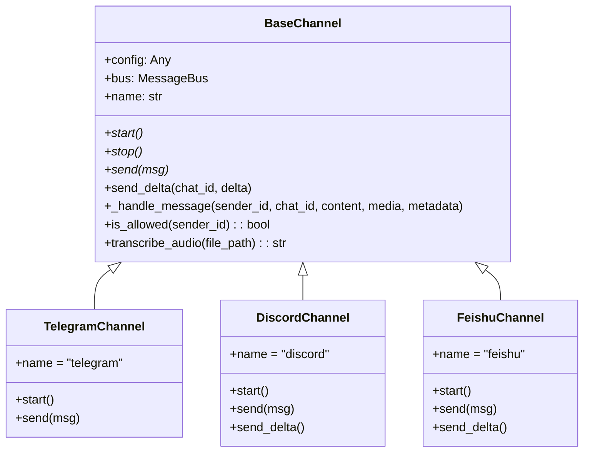
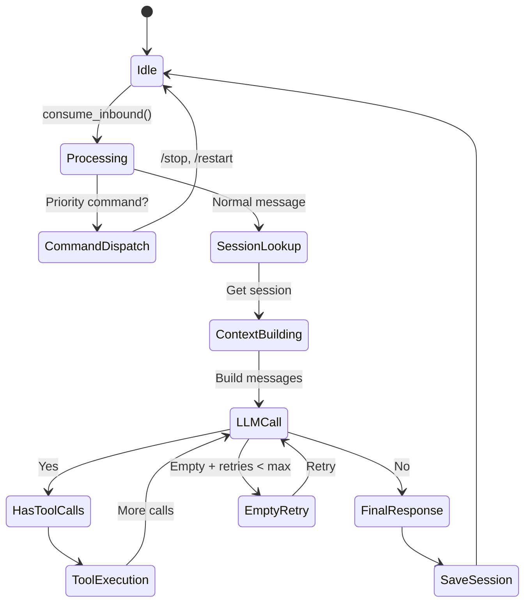
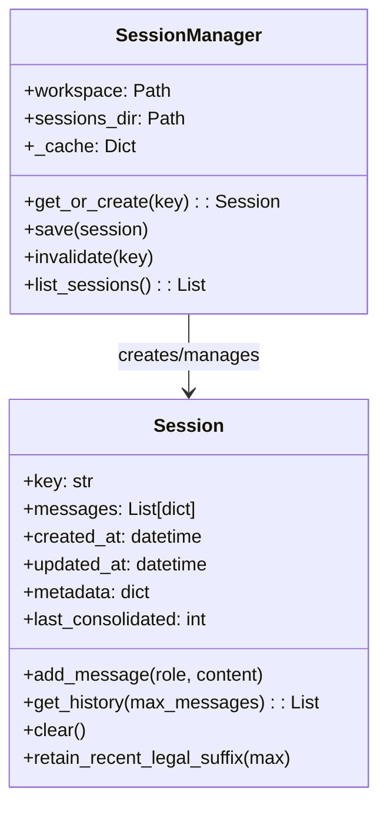
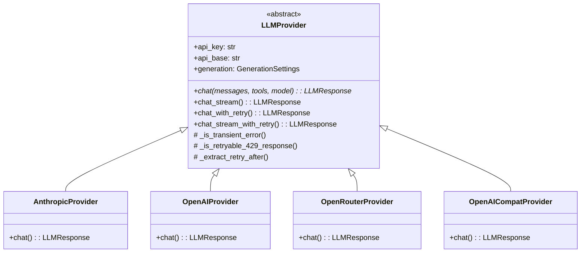
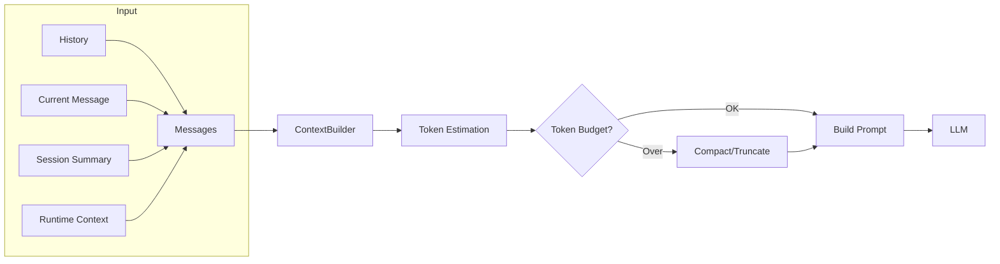
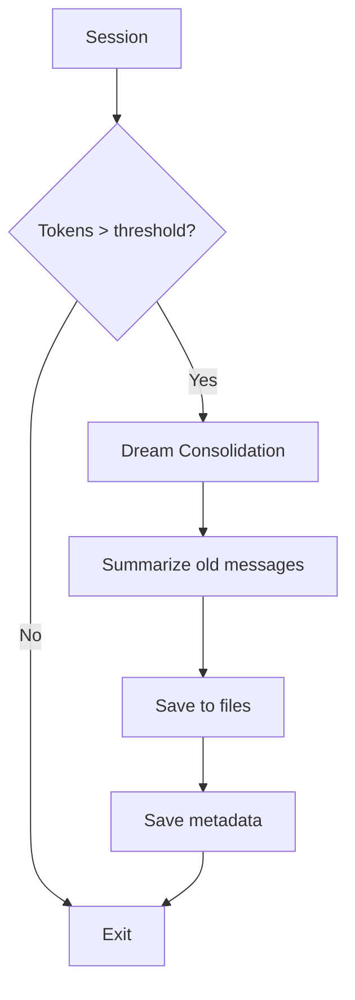

# Nanobot - Architecture Analysis

## 🏗️ High-Level Architecture

Nanobot sử dụng kiến trúc **Event-Driven Message Bus** với separation of concerns rõ ràng giữa các layers:

```
┌─────────────────────────────────────────────────────────────────────┐
│                         Chat Platforms                                │
│   (Telegram, Discord, Slack, Feishu, WhatsApp, WeChat, QQ, etc.)   │
└─────────────────────────────────────────────────────────────────────┘
                                    │
                                    ▼
┌─────────────────────────────────────────────────────────────────────┐
│                    Channel Layer (channels/)                         │
│   BaseChannel → Telegram, Discord, Slack, Feishu, WhatsApp...      │
│   - Protocol handling (WebSocket, HTTP, polling)                   │
│   - Message normalization                                             │
│   - Access control (allowFrom)                                        │
└─────────────────────────────────────────────────────────────────────┘
                                    │
                                    ▼
┌─────────────────────────────────────────────────────────────────────┐
│                    Message Bus (bus/)                                │
│   InboundMessage ◄──────────────────► OutboundMessage                │
│   - publish_inbound() / publish_outbound()                          │
│   - Queue-based async communication                                  │
└─────────────────────────────────────────────────────────────────────┘
                                    │
                                    ▼
┌─────────────────────────────────────────────────────────────────────┐
│                    Agent Core (agent/)                                │
│                                                                     │
│   ┌─────────────┐    ┌─────────────┐    ┌─────────────────────┐   │
│   │ AgentLoop    │◄──►│ AgentRunner │◄──►│ ToolRegistry        │   │
│   │ (nanobot.py) │    │ (runner.py) │    │ (builtin + MCP)    │   │
│   └─────────────┘    └─────────────┘    └─────────────────────┘   │
│                                                                     │
│   Components:                                                        │
│   - ContextBuilder: Build LLM prompts                               │
│   - Memory: Token-based memory management                            │
│   - Hooks: Lifecycle event handlers                                  │
│   - Subagents: Nested agent execution                                │
└─────────────────────────────────────────────────────────────────────┘
                                    │
                                    ▼
┌─────────────────────────────────────────────────────────────────────┐
│                    LLM Providers (providers/)                        │
│   BaseProvider → Anthropic, OpenAI, OpenRouter, DeepSeek, etc.     │
│   - chat_with_retry() / chat_stream_with_retry()                   │
│   - Tool call handling                                               │
│   - Error classification & retry logic                               │
└─────────────────────────────────────────────────────────────────────┘
```

## 🔄 Message Flow - Sequence Diagram

```mermaid
sequenceDiagram
    participant User
    participant Channel as Chat Platform
    participant Bus as Message Bus
    participant Loop as AgentLoop
    participant Runner as AgentRunner
    participant LLM as LLM Provider
    participant Tools as ToolRegistry
    participant Session as SessionManager

    User->>Channel: Send message
    Channel->>Bus: publish_inbound(InboundMessage)
    
    Loop->>Bus: consume_inbound()
    
    Loop->>Session: get_or_create(key)
    Session-->>Loop: Session
    
    Loop->>Runner: run(AgentRunSpec)
    
    Runner->>LLM: chat_with_retry(messages, tools)
    LLM-->>Runner: LLMResponse (content + tool_calls)
    
    alt Has tool_calls
        Runner->>Tools: execute(tool_name, params)
        Tools-->>Runner: tool_result
        
        Runner->>LLM: chat_with_retry(messages + tool_result)
        Note over Runner: Loop until stop condition
    end
    
    Runner-->>Loop: AgentRunResult(final_content, messages)
    
    Loop->>Session: save(messages)
    
    Loop->>Bus: publish_outbound(OutboundMessage)
    
    Bus->>Channel: send(message)
    Channel->>User: Display response
```

## 🧩 Component Architecture

### 1. Channel Layer



**Design Pattern**: Plugin-based Channel Architecture
- Mỗi channel implement `BaseChannel` interface
- Channel được register qua `ChannelRegistry`
- Config-driven enable/disable

### 2. Agent Loop



### 3. Session Management



**Design Pattern**: Repository Pattern với In-Memory Cache
- Sessions được cache in-memory
- Persistence qua JSONL files
- Migration support từ legacy paths

### 4. LLM Provider Architecture



**Design Pattern**: Strategy Pattern với Retry Policy
- Unified interface cho tất cả providers
- Built-in retry logic với exponential backoff
- 429 error classification (retryable vs non-retryable)

### 5. Command Router

```mermaid
flowchart TD
    A[Message] --> B{is_priority?}
    B -->|Yes| C[/stop, /restart]
    B -->|No| D{Exact match?}
    D -->|Yes| E[/clear, /status]
    D -->|No| F{Prefix match?}
    F -->|Yes| G[/team, /skill]
    F -->|No| G{Hook interceptors?}
    G -->|Yes| H[Custom handlers]
    G -->|No| I[Pass to agent]
```

**Design Pattern**: Chain of Responsibility
- Priority → Exact → Prefix → Interceptors
- Prefix matching với longest-first ordering

## 🔌 API Layer (OpenAI-Compatible)

```mermaid
sequenceDiagram
    participant Client
    participant API as API Server
    participant Loop as AgentLoop
    participant Session as SessionManager
    
    Client->>API: POST /v1/chat/completions
    Note over API: { messages: [...], session_id: "abc" }
    
    API->>API: session_lock = get_lock(session_id)
    API->>Loop: process_direct(content, session_key)
    
    Loop->>Session: get_or_create(key)
    Loop->>Loop: Run agent loop
    
    Loop-->>API: OutboundMessage(content)
    
    API-->>Client: { choices: [{ message: {...} }] }
```

## 🛡️ Security Architecture

```
┌─────────────────────────────────────────────────────────────┐
│                    Security Layers                           │
├─────────────────────────────────────────────────────────────┤
│  1. Channel Access Control                                   │
│     - allowFrom: whitelist sender IDs                        │
│     - "*" for public access                                  │
├─────────────────────────────────────────────────────────────┤
│  2. Workspace Isolation                                      │
│     - Restricted file access to workspace path               │
│     - Path validation before file operations                │
├─────────────────────────────────────────────────────────────┤
│  3. Tool Sandboxing                                          │
│     - Built-in tools sandboxed by design                     │
│     - MCP tools via MCP protocol isolation                   │
├─────────────────────────────────────────────────────────────┤
│  4. Secrets Management                                       │
│     - Environment variable substitution: ${VAR_NAME}         │
│     - No hardcoded secrets in config.json                  │
└─────────────────────────────────────────────────────────────┘
```

## 📊 Data Flow Patterns

### Context Building Pipeline



### Memory Consolidation



## 🎯 Key Design Decisions

| Decision | Rationale | Impact |
|----------|-----------|--------|
| Message Bus Architecture | Decouple channels from agent | Easy to add new channels |
| Session per Channel+Chat | Natural conversation grouping | Better context management |
| Tool Registry Pattern | Extensible tool system | Plugins via MCP |
| Provider Abstraction | Multi-LLM support | Vendor lock-in avoidance |
| JSONL Persistence | Simple, line-based storage | Easy debugging, streaming writes |
| Config-driven | No hardcoded values | Flexible deployment |
